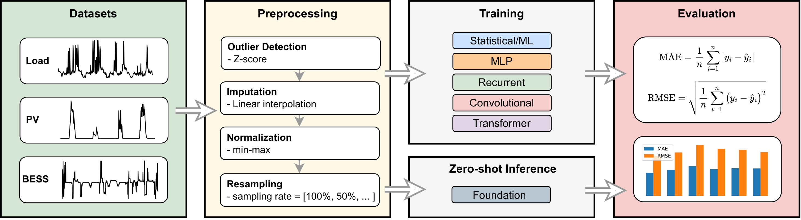
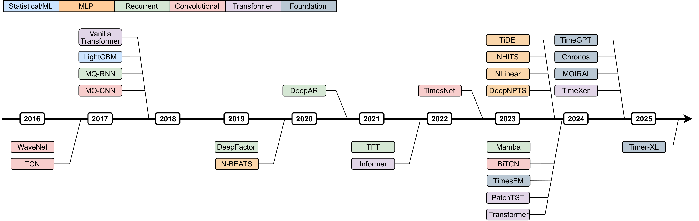

# A Survey and Benchmark for Household Electricity Forecasting: From Statistical to Foundation Models

This is the official repository for our work on benchmarking forecasting models on **household energy consumption and generation** tasks. We evaluate **30 representative time-series forecasting models** spanning the full spectrum of forecasting approaches, from classical statistical and machine learning models to modern deep learning architectures and **time series foundation models (TSFMs)**. All models are evaluated within a **unified benchmarking framework** to ensure fair comparison. The study focuses on three key residential energy forecasting tasks:

- **Electricity load forecasting**
- **Solar photovoltaic (PV) generation forecasting**
- **Battery energy storage system (BESS) operation forecasting**

The benchmarking pipeline applies a standardized preprocessing workflow including **missing value interpolation, outlier detection, normalization, and temporal resampling**. Models are evaluated using their **default configurations** to assess their **out-of-the-box performance** without extensive hyperparameter tuning. The main objectives of this work are therefore to:

- Provide a **broad comparison of forecasting models** of different architectures
- Establish a **consistent benchmarking framework**
- Evaluate model performance across **multiple real-world energy forecasting tasks**
- Investigate the **zero-shot forecasting capabilities of TSFMs**



## Quick Start

### Create environment and install dependencies

To reproduce the results, there is need to create several python environments for different model libraries to avoid confliciting packages. The links to the repositories of all the models evaluated in this work are presented in the **Forecasting Models** section.

Every model script provides CLI help and keeps its previous benchmark settings as defaults:

```bash
python models/model_naivedrift.py --help
python models/model_naivedrift.py --dataset london --sampling_rate 100 --runs 1
python models/models_neuralforecast.py --dataset germany --models NBEATS NHITS --epochs 100 --runs 1
```

The common options are `--dataset`, `--sampling_rate` (one or more percentages), `--runs`, and `--results_dir`. Multi-model scripts also provide `--models`; trainable models provide `--epochs` where applicable. Foundation-model scripts expose their checkpoint, device, batch_size, and service settings through their own CLI options. Data and result defaults are resolved from the repository root, independent of the launch directory.

The executable analysis utilities also provide CLI help:

```bash
python utils/plots.py --directory results/results_belgium/AutoARIMA/Sampling_100/Run_1
python utils/dm_test.py --datasets belgium germany --font_size 9
```

Use `python <script> --help` for all available options.

## Datasets

Datasets are loaded via [utils/dataset_config.py](utils/dataset_config.py). File locations used by the loaders:

- Belgium PV and battery datasets: [data/belgium_dataset](data/belgium_dataset)
- Germany WPUQ (SFH19): [data/germany_wpuq_dataset/SFH19_2023_2024_15min_3_month.csv](data/germany_wpuq_dataset/SFH19_2023_2024_15min_3_month.csv)
- London smart meter dataset: [data/london_dataset/LCL_london_consumption_2013.csv](data/london_dataset/LCL_london_consumption_2013.csv)
- Zonnedael dataset: [data/zonnedael_dataset/liander_zonnedael_2013_original.csv](data/zonnedael_dataset/liander_zonnedael_2013_original.csv)

## Forecasting Models

Each model lists its primary library and a GitHub repository. Scripts are linked for direct execution.



### 1. Statistical and Machine Learning

| Model | Library | Repository | Script |
|------|---------|------------|--------|
| AutoARIMA | pmdarima | https://github.com/alkaline-ml/pmdarima | [models/models_statsml.py](models/models_statsml.py) |
| KNN Regression | scikit-learn | https://github.com/scikit-learn/scikit-learn | [models/models_statsml.py](models/models_statsml.py) |
| LightGBM | LightGBM | https://github.com/microsoft/LightGBM | [models/models_statsml.py](models/models_statsml.py) |
| Naive Drift | custom (numpy, pandas) | https://github.com/numpy/numpy | [models/model_naivedrift.py](models/model_naivedrift.py) |
| Naive Moving Average | custom (numpy, pandas) | https://github.com/pandas-dev/pandas | [models/models_statsml.py](models/models_statsml.py) |

Complete CLI examples:

```bash
# AutoARIMA, KNN Regression, LightGBM, and Naive Moving Average
python models/models_statsml.py --dataset london --sampling_rates 25 100/3 50 100 --models KNNRegression LightGBM ARIMA NaiveMovingAverage --runs 1 --results_dir results

# Naive Drift
python models/model_naivedrift.py --dataset belgium --sampling_rates 25 100/3 50 100 --runs 1 --results_dir results
```

### 2. MLP-based Models

| Model | Library | Repository | Script |
|------|---------|------------|--------|
| DeepNPTS | NeuralForecast | https://github.com/Nixtla/neuralforecast | [models/models_neuralforecast.py](models/models_neuralforecast.py) |
| N-BEATS | NeuralForecast | https://github.com/Nixtla/neuralforecast | [models/models_neuralforecast.py](models/models_neuralforecast.py) |
| NHITS | NeuralForecast | https://github.com/Nixtla/neuralforecast | [models/models_neuralforecast.py](models/models_neuralforecast.py) |
| NLinear | NeuralForecast | https://github.com/Nixtla/neuralforecast | [models/models_neuralforecast.py](models/models_neuralforecast.py) |
| TiDE | NeuralForecast | https://github.com/Nixtla/neuralforecast | [models/models_neuralforecast.py](models/models_neuralforecast.py) |

Complete CLI example:

```bash
python models/models_neuralforecast.py --dataset belgium --sampling_rates 25 100/3 50 100 --models DeepNPTS NBEATS NHITS NLinear TiDE --runs 10 --epochs 100 --results_dir results
```

### 3. Recurrent Networks

| Model | Library | Repository | Script |
|------|---------|------------|--------|
| DeepAR | GluonTS | https://github.com/awslabs/gluonts | [models/models_gluonts.py](models/models_gluonts.py) |
| DeepFactor | GluonTS | https://github.com/awslabs/gluonts | [models/models_gluonts.py](models/models_gluonts.py) |
| MQ-RNN | GluonTS | https://github.com/awslabs/gluonts | [models/models_gluonts.py](models/models_gluonts.py) |
| Mamba | mamba-ssm | https://github.com/state-spaces/mamba | [models/model_mamba.py](models/model_mamba.py) |
| Temporal Fusion Transformer (TFT) | GluonTS | https://github.com/awslabs/gluonts | [models/models_gluonts.py](models/models_gluonts.py) |

Complete CLI examples:

```bash
# DeepAR, DeepFactor, MQ-RNN, and Temporal Fusion Transformer
python models/models_gluonts.py --dataset belgium --sampling_rates 25 100/3 50 100 --models DeepAR DeepFactor MQRNN TemporalFusionTransformer --runs 10 --epochs 100 --results_dir results

# Mamba
python models/model_mamba.py --dataset belgium --sampling_rates 25 100/3 50 100 --runs 10 --epochs 100 --results_dir results
```

### 4. Convolutional Networks

| Model | Library | Repository | Script |
|------|---------|------------|--------|
| TCN | NeuralForecast | https://github.com/Nixtla/neuralforecast | [models/models_neuralforecast.py](models/models_neuralforecast.py) |
| BiTCN | NeuralForecast | https://github.com/Nixtla/neuralforecast | [models/models_neuralforecast.py](models/models_neuralforecast.py) |
| TimesNet | NeuralForecast | https://github.com/Nixtla/neuralforecast | [models/models_neuralforecast.py](models/models_neuralforecast.py) |
| WaveNet | GluonTS | https://github.com/awslabs/gluonts | [models/models_gluonts.py](models/models_gluonts.py) |
| MQ-CNN | GluonTS | https://github.com/awslabs/gluonts | [models/models_gluonts.py](models/models_gluonts.py) |

Complete CLI examples:

```bash
# TCN, BiTCN, and TimesNet
python models/models_neuralforecast.py --dataset belgium --sampling_rates 25 100/3 50 100 --models TCN BiTCN TimesNet --runs 10 --epochs 100 --results_dir results

# WaveNet and MQ-CNN
python models/models_gluonts.py --dataset belgium --sampling_rates 25 100/3 50 100 --models WaveNet MQCNN --runs 10 --epochs 100 --results_dir results
```

### 5. Transformer-based Models

| Model | Library | Repository | Script |
|------|---------|------------|--------|
| Informer | NeuralForecast | https://github.com/Nixtla/neuralforecast | [models/models_neuralforecast.py](models/models_neuralforecast.py) |
| PatchTST | NeuralForecast | https://github.com/Nixtla/neuralforecast | [models/models_neuralforecast.py](models/models_neuralforecast.py) |
| iTransformer | NeuralForecast | https://github.com/Nixtla/neuralforecast | [models/models_neuralforecast.py](models/models_neuralforecast.py) |
| Vanilla Transformer | NeuralForecast | https://github.com/Nixtla/neuralforecast | [models/models_neuralforecast.py](models/models_neuralforecast.py) |
| TimeXer | NeuralForecast | https://github.com/Nixtla/neuralforecast | [models/models_neuralforecast.py](models/models_neuralforecast.py) |

Complete CLI example:

```bash
python models/models_neuralforecast.py --dataset belgium --sampling_rates 25 100/3 50 100 --models Informer PatchTST iTransformer VanillaTransformer TimeXer --runs 10 --epochs 100 --results_dir results
```

### 6. Time Series Foundation Models

| Model | Library | Repository | Script |
|------|---------|------------|--------|
| TimeGPT | nixtla | https://github.com/Nixtla/nixtla | [models/fmodel_timegpt.py](models/fmodel_timegpt.py) |
| TimesFM | timesfm | https://github.com/google-research/timesfm | [models/fmodel_timesfm.py](models/fmodel_timesfm.py) |
| MOIRAI | uni2ts | https://github.com/SalesforceAIResearch/uni2ts | [models/fmodel_moirai.py](models/fmodel_moirai.py) |
| Chronos | chronos-forecasting | https://github.com/amazon-science/chronos-forecasting | [models/fmodel_chronos.py](models/fmodel_chronos.py) |
| Timer-XL | transformers | https://github.com/huggingface/transformers | [models/fmodel_timerxl.py](models/fmodel_timerxl.py) |

Complete CLI examples:

```bash
# TimeGPT
python models/fmodel_timegpt.py --dataset belgium --sampling_rates 25 100/3 50 100 --runs 1 --api_key nixak-XXXXXXXXXXXXXXXXXXXXXXXXXXXXXX --model timegpt-1-long-horizon --confidence_level 95 --finetune_steps 0 --finetune_depth 1 --results_dir results

# TimesFM
python models/fmodel_timesfm.py --dataset belgium --sampling_rates 25 100/3 50 100 --runs 1 --backend gpu --batch_size 32 --model_id google/timesfm-1.0-200m-pytorch --results_dir results

# MOIRAI
python models/fmodel_moirai.py --dataset belgium --sampling_rates 25 100/3 50 100 --runs 1 --model moirai --size small --patch_size auto --batch_size 32 --results_dir results

# Chronos
python models/fmodel_chronos.py --dataset belgium --sampling_rates 25 100/3 50 100 --runs 1 --model_id amazon/chronos-bolt-small --device auto --results_dir results

# Timer-XL
python models/fmodel_timerxl.py --dataset belgium --sampling_rates 25 100/3 50 100 --runs 1 --model_id thuml/timer-base-84m --save_folder TimerXL --device auto --results_dir results
```

## Notes

- Some models can run on the CPU while others require GPU for practical runtimes.
- TimeGPT requires a valid API key supplied with `--api_key`.
- Timer-XL uses Hugging Face model IDs. Use `--model_id` and `--save_folder` to switch models.
- Chronos, TimesFM, and MOIRAI may download weights on first run.

## Results

All model outputs are saved in the `results` folder with per-run plots and metrics summaries. Generated CSV floating-point values use at most six decimal places. The plotting and metrics utilities are in [utils/metrics.py](utils/metrics.py) and [utils/plots.py](utils/plots.py). Please refer to our paper for the results.
